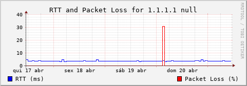

# rrdping #

Simple bash tool to monitor the network latency and packet loss using ICMP (ping).

This tool was used to detect and quantify the stability of home routers and Wan connection. Running on Raspberry PI connected directly to the router.



Note: the DB used to store the collected information is the [RRDtool](https://oss.oetiker.ch/rrdtool/), that uses a compact and fixed size file to store the data. However, the data is store in binary format that can be incompatible across hardware.

# install #

*get the software*

```
sudo apt-get install -y rrdtool fping
sudo mkdir /apps
cd /apps
git clone https://github.com/pedro-d22eaf/rrdping.git
```

*edit targets list*

```
echo "1.1.1.1" >> ping-target.cfg
```

*generate rrd files*

```
make create_rrds
```

*start service at boot* (systemd)

```
cp rrdping.service  /lib/systemd/system/
sudo systemctl daemon-reload
sudo systemctl enable rrdping.service
reboot
```

*generate PNGs*

```
./rrdping/generate_pngs.sh
```
